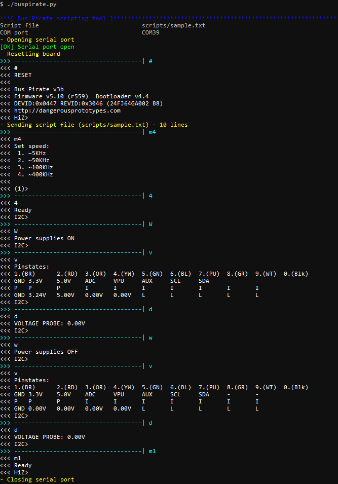

# BusPirate

A simple scripting tool for Bus Pirate written in Python.

It allows you to save your *scripts* in text files, using the same syntax you are using in the terminal, and showing the same results.

Can be used as an automation tool when you need to do repetitive tasks with your Bus Pirate, or simply to keep a list of useful scripts (e.g. basic testing of LCD screens)



It uses the [basic text mode](http://dangerousprototypes.com/docs/Bus_Pirate_menu_options_guide) used for terminal access, **not** the [bitbang protocol](http://dangerousprototypes.com/docs/Bitbang). This makes the tool not suitable for timing-strict applications, for those kind of scripts you will have to find yourself a *bitbanging library* ([see here](http://dangerousprototypes.com/docs/Bus_Pirate_Scripting_in_Python))

## How to install it

* Make sure you have [python 3](https://www.python.org/downloads/) installed
* Clone this repo (or download and extract the .zip file)

## How to use it

### Quick tryout

* Windows: `python3 buspirate.py -c [COM_PORT]`
* Linux: `./buspirate.py -c [COM_PORT]`
	* (make sure you `chmod -x buspirate.py`)

Examples:

* Windows: `python3 buspirate.py -c COM10`
* Linux: `./buspirate.py -c /dev/ttyACM0` (not tested yet)

This will connect to your bus pirate in `[COM PORT]` and run the sample script provided with the project (the one in the screenshot).

### Normal usage

Once you have set your default COM port and script (see *Configuration* section), you can use the program as follows:

If you want to run the default script:

* Windows: `python3 buspirate.py`
* Linux: `./buspirate.py`

If you want to run a different script:

* Windows: `python3 buspirate.py scripts/some-script.txt`
* Linux: `./buspirate.py scripts/some-script.txt`

### Syntax

```
usage: buspirate.py [-h] [-c COMPORT] [scriptFileName]

positional arguments:
  scriptFileName        set script file to use (default: scripts/sample.txt)

optional arguments:
  -h, --help            show this help message and exit
  -c COMPORT, --comPort COMPORT
                        set COM port (default: COM39)
```

### Configuration

Open `config.py` with your favorite text editor to change default settings.

The settings you might want to change are:

* `SCRIPT_FILE`: default script to be run if none is specified in the command line
* `SERIAL_PORT`: default serial port name
* `RESET_AT_STARTUP`: if `True` the board is always reset before processing a script
* `RESET_AT_END`: if `True` the board is always reset after processing a script
* `SCRIPT_BLANK_LINE_DELAY`: milliseconds to *sleep* when a blank line is found

## Scripts

Some sample scripts are provided, but the key to make this program useful is to create your own scripts. You can use the `scripts/` folder to store them.

### sample.txt

This is the default script configured to be executed if none is specified in the command line.

This script does not need anything connected to your Bus Pirate.

```
m4      <<< set I2C mode
4       <<< set I2C speed (400KHz)
W       <<< start power supplies
v       <<< read pin states
d       <<< read voltage probe
        <<< delay
w       <<< stop power supplies
v       <<< read pin states
d       <<< read voltage probe
m1      <<< set HiZ mode
```

### reset.txt

This script resets your board.

It is an empty file, so it relies in your configuration having `RESET_AT_STARTUP` or `RESET_AT_END` set to `True`.

If you want to have both of them set to `False` in your configuration, edit `reset.txt` script and add a '#' character, which is the Bus Pirate *reset* command.

### lcd.txt

This scripts does a simple test on a 2-line [HD44780 compatible LCD screen](https://www.sparkfun.com/datasheets/LCD/HD44780.pdf) (**PDF warning**) using a [Bus Pirate LCD adapter](http://dangerousprototypes.com/docs/Bus_Pirate_v3_LCD_adapter).

```
m8                    <<< set LCD mode
W                     <<< start power supplies
(1)                   <<< reset LCD
(2)                   <<< init LCD
2                     <<< set number of lines (2)
(3)                   <<< clear LCD
(4) 0  "Bus Pirate"   <<< set cursor to 0 and write text
(4) 40 "LCD test"     <<< set cursor to 40 (line 2) and write text
```

**NOTE**: This script does **not** reset the board to *HiZ* mode at the end to keep the display ON with the message. To stop the LCD screen you can use the `reset` script.

### rtc.txt

This scripts reads the date and time from a [DS1307 RTC](https://datasheets.maximintegrated.com/en/ds/DS1307.pdf) (**PDF warning**) via I2C.

```
m4                             <<< set I2C mode
3                              <<< set I2C speed (100KHz)
W                              <<< start power supplies
[ 0xd0 0x00 [ 0xd1 rrrrrrr ]   <<< read 7 bytes from addr 0xd1 reg 0x00
w                              <<< stop power supplies
m1                             <<< set HiZ mode
```

